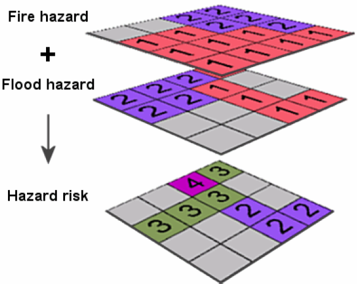

=====================================
ANÁLISIS ESPACIAL – MODELO    RASTER 
=====================================
:Autor: Ing. Luis Carlos Berrocal

.. contents::
.. sectnum::

Introducción
============

DENOMINACIÓN DEL CURSO: ANÁLISIS ESPACIAL – MODELO    RASTER 
ABREVIATURA:    AER            CODIGO:    005            
CREDITOS: 4       DURACIÓN: 1 MES        PREREQUISITO: AVG-004

Descripción Del Curso
---------------------

Los sistemas raster representan la superficie terrestre por medio de rejillas (celdas).  El tamaño de la celda establece la escala del mapa, es 
decir la relación que existe entre una longitud o superficie de la realidad del terreno y su representación en el mapa. La potencialidad de este 
modelo radica en la posibilidad de modelar la superficie terrestre de una manera eficiente de acuerdo a diversas variables  temáticas que van 
desde las físico naturales hasta las desarrolladas por la acción humana. Los sistemas raster complementan a los sistemas vectoriales

Objetivos Generales
-------------------

Establecer las características de un sistema de información raster
Seleccionar el tamaño de la celda más apropiado
Rasterizar información digital en formato vectorial
Definir las principales funciones de análisis 
Conocer las potencialidades de los modelos digitales del terreno
Desarrollar aplicaciones e formatos raster  

Objetivos Específicos
---------------------

Conocer las características de los SIG-raster 
Explicar las principales herramientas analíticas que operan los sistemas
Aplicar los sistemas raster en funciones de proximidad, distancia y barreras (costos)                               
Aplicar los modelos digitales del terreno en la caracterización topográfica de terreno
Aplicar  los modelos raster en las funciones hidrológicas y ambientales                                    
 
Contenido
---------

Características del formato raster
Búsqueda  y recuperación de información de una base de datos geográfica raster
Reclasificación de datos
Superposición de mapas 
Análisis de vecindad
Modelos digitales del terreno
Análisis de un modelo digital del terreno
Aplicaciones topográficas y ambientales
Desarrollo de un proyecto SIG-raster
 
Estrategia Metodológica
-----------------------

La metodología del curso está basada en la formación flexible, donde se combina el material didáctico impreso, ejercicios de aplicación, 
vídeos didácticos y aplicaciones informáticas de propósito didáctico o de entrenamiento, con la asistencia a puntuales jornadas técnicas 
donde se entra en contacto directo con el equipo docente del curso y con especialistas tanto del mundo universitario como del mundo empresarial. 
El contacto directo profesor alumno está garantizado a lo largo de todo el curso, no sólo en base a las jornadas técnicas programadas, 
sino a los medios de comunicación que lo hacen hoy día posible. En este sentido se considera idónea la comunicación vía correo electrónico, 
que permite al alumno realizar su consulta en cualquier momento y al profesor dar una respuesta meditada en un plazo razonable de tiempo. 
Pero ello no impide que, cuando se considere necesario, se pueda recurrir a otros medios de comunicación más sofisticados como la 
videoconferencia o la comunicación directa vía Internet. 

En las páginas de acceso Latina Learning Site en Internet los alumnos encuentran tanto contenidos y estructura básica del curso como 
información complementaria, así como el enlace a un foro de discusión exclusivo para los participantes. 

Recursos Didácticos
-------------------

Conferencias: Con lecciones documentadas por Internet; adicionalmente se facilitaran referencias bibliográficas a los estudiantes.
Actividades Prácticas: Se facilitará el guión a los estudiantes, y un profesor/instructor le asistirá en su desarrollo. Se facilitarán imágenes satelitales,  fotografías aéreas y otros datos.
Se trabajará de manera continúa con una herramienta bajo la coordinación de un profesor tutor, los estudiantes realizaran trabajos de investigación, prácticas y preparación y desarrollo de proyectos relativos a la  asignatura en curso.

Criterios De Evaluación
-----------------------

2 Exámenes Parciales (15% cada uno)                          30%
Trabajos grupales                                                         20%
Estudios de casos, Investigaciones, Tareas                   20%
Proyecto Final                                                               30%
Total                                                                             100%

Bibliografía Básica
-------------------

GIS Modeling in Raster, Michael DeMers, John Wiley & Sons, 2002.
Exploring spatial analysis in geographic information systems, Yue-Hong Chou, OnWord Press, 1997.
The Handbook of Geographic Information Science, Nicholas J. Tate, Peter F. Fisher, David J. Martin, Blackwell Publishing, 2008.

¿Qué es el formato RASTER?
==========================

.. image:: images/raster_format.gif

 
Modelo Raster
=============

Representan una superficie continua (los vectores presentan datos discreto).

Pueden tener valores enteros o decimales.

La unidad fundamental de análisis es la celda

Regularmente son cuadradas. Aunque algunos argumentan que debe ser hexagonal [#]_

.. [#] Rasterdata Structures http://geodata.ethz.ch/geovite/tutorials/L2GeodataStructuresAndDataModels/en/html/unit_u2Raster.html

Ventajas y Desventajas de los Modelos Raster
============================================
* Ventajas

  * Estructura de datos simple

  * Fácil de generar

  * Es sencillo realizar análisis

* Desventajas

  * Archivos grandes

  * Estructura de datos rígida

¿Cómo utilizamos los datos Raster?
==================================

* Algebra de mapas

  * Propuesta a principios de los ‘80s por el Dr. Dana Tomlin. 

  * Consiste en operaciones matemáticas básicas entre celdas de diferentes rasters.

* Por ejemplo:

  * Pendientes fuertes = Pendiente > 15

Problemas de Representación
---------------------------

Que ocurre cuando se realizan operaciones entre temas Raster que tienen diferentes tamaños de celdas.
   
 
Para realizar la operación es necesario aplicar un proceso previo que se conoce como remuestreo (resampling).

Nearest-neighbor interpolation
~~~~~~~~~~~~~~~~~~~~~~~~~~~~~~

The simplest method, simply assigns to each yellow cell the value in the blue cell nearest its center. 
By not requiring any numerical computations, this method works for categorical data.  Because it does not really interpolate values, 
it generally performs poorly for numerical data.

Bilinear Interpolation 
~~~~~~~~~~~~~~~~~~~~~~

Uses the four blue values surrounding the center of each yellow cell.  By translating and rescaling the coordinates, which will not change the interpolation, we may suppose the yellow square is centered at (x, y) and the centers of the surrounding blue cells are located at (0,0), (1,0), (0,1), and (1,1), where they have values Z00, Z10, Z01, and Z11, respectively.

Cubic Convolution 
~~~~~~~~~~~~~~~~~

Generalizes bilinear interpolation.  The sixteen blue cells surrounding each yellow cell determine the interpolated value.  

Remuestreo en Spatial Analyst
=============================

Spatial Analyst es una extensión de ArcGIS Desktop que se utiliza para análisis raster.

Cuidados que se deben tener al realizar análisis con Spatial Analyst
--------------------------------------------------------------------

Distinción de Rasters de Tipo Entero y Real

Los rasters enteros se muestran como Pixel Type Unsigned Integer o Signed Integer. Los valores reales (con decimales) se muestran con  Pixel Type Floating Point.
Entero:
 
 

Reales (decimales)
 
7.1.2	Operaciones entre Enteros y Reales

7.1.2.1	Multiplicación

dem_clip3 * 1.25 = rastercalc2
Donde:
dem_clip3: continuous, signed integer, 16bits
rastercalc2: continuous, floating point, 32bits
 
dem_clip3 * Feature_area1 = restarcalc3
Donde:
dem_clip3: continuous, signed integer, 16bits
Feature_area1: continuous, unsigned integer, 8bits
rastercalc3: continuous, signed integer, 32bits
El resultado se ajusta al raster Feature_area1.
 
dem_clip3 * rastercalc3 = restarcalc4
Donde:
dem_clip3: continuous, signed integer, 16bits
rastercalc3: continuous, floating point, 32bits
rastercalc4: continuous, signed integer, 32bits
Perdida de precisión.
El workaround es:
Float("dem_clip3") * "rastercalc3" = rastercalc5
rastercalc4: continuous, floating point, 32bits

Make sure you only use nearest neighbor interpolation for grids with categorical data.  For these grids, interpolation has little or no meaning.  For example, if your grid uses a value of 0 for wetlands, 1 for desert, and 2 for urban land cover, then interpolating between wetlands (0) and urban land (2) can easily produce values near 1 (desert), which is ridiculous.
 
Remember, any image using a color palette is categorical.  USGS topographic maps (so-called digital raster graphics, or DRGs) are typically represented this way. 

 

 

8	NoData
El valor NoData es un valor especial que describe que no hay data en la celda.
Las operaciones que tienen como entrada NoData retornan no data.
NoData *2 = NoData
Bibibliografia
http://docutils.sourceforge.net/docs/user/rst/quickref.html
Apéndice A	Fuentes de Datos
Smithsonian http://mapserver.stri.si.edu/v2/catalog 
Apéndice B	Crear un Raster a partir de un Poligono

 

 

 
 
Apéndice C	Clip un Raster con un Polígono
 
 
Apéndice D	Reproyeccion
 
Apéndice E	Recolectar Datos de Street Maps
Capturar la Imagen
Georeferenciar
 
Cargar la imagen
 
 

 
Haga zoom a área de trabajo
 
Seleccione Fit to Display