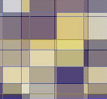
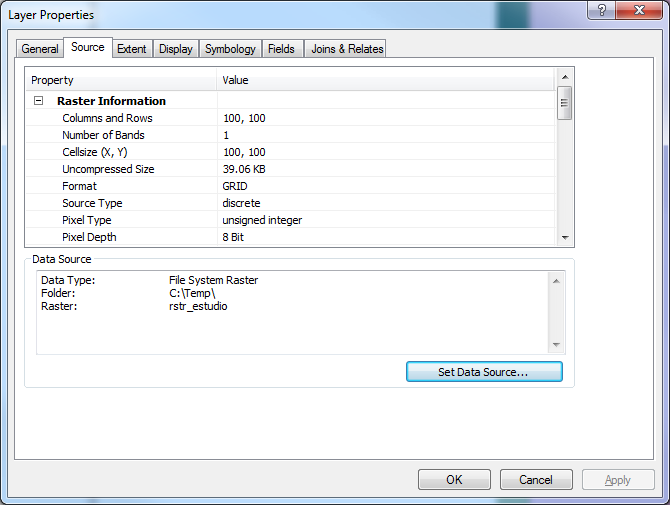
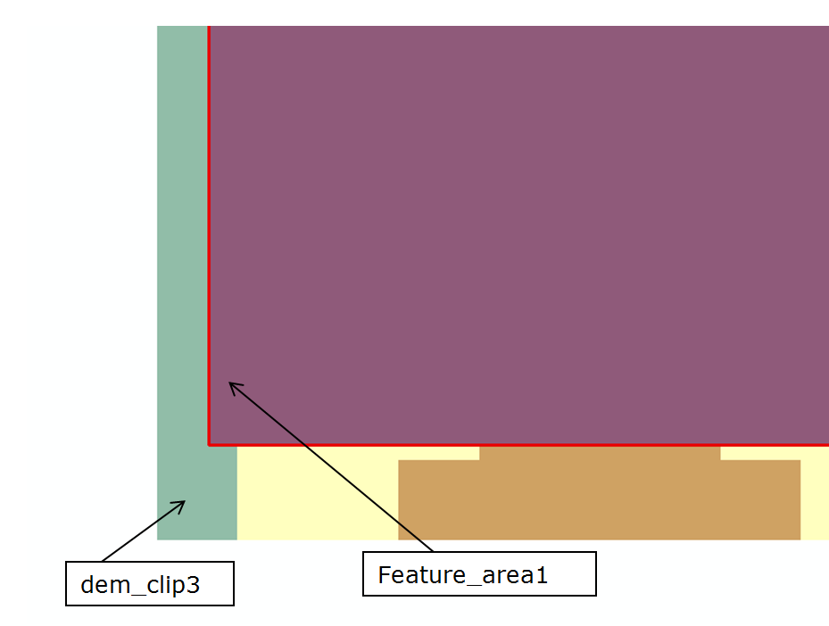

=====================================
Análisis Espacial Raster
=====================================

.. |date| date::
.. |time| date:: %H:%M

:Autor: Ing. Luis Carlos Berrocal
:Actualizado: |date| |time|

.. contents::
.. sectnum::

Introducción
============

DENOMINACIÓN DEL CURSO: ANÁLISIS ESPACIAL – MODELO    RASTER 

ABREVIATURA:    AER            

CODIGO:    005            

CREDITOS: 4       

DURACIÓN: 1 MES        

PREREQUISITO: AVG-004

Clases
------

* Marzo 3, 2012
* Marzo 10, 2012
* Marzo 17, 2012
* Marzo 24, 2012

Descripción Del Curso
---------------------

Los sistemas raster representan la superficie terrestre por medio de rejillas (celdas).  El tamaño de la celda establece la escala del mapa, es 
decir la relación que existe entre una longitud o superficie de la realidad del terreno y su representación en el mapa. La potencialidad de este 
modelo radica en la posibilidad de modelar la superficie terrestre de una manera eficiente de acuerdo a diversas variables  temáticas que van 
desde las físico naturales hasta las desarrolladas por la acción humana. Los sistemas raster complementan a los sistemas vectoriales

Objetivos Generales
-------------------

#. Establecer las características de un sistema de información raster
#. Seleccionar el tamaño de la celda más apropiado
#. Rasterizar información digital en formato vectorial
#. Definir las principales funciones de análisis 
#. Conocer las potencialidades de los modelos digitales del terreno
#. Desarrollar aplicaciones e formatos raster  

Objetivos Específicos
---------------------

#. Conocer las características de los SIG-raster 
#. Explicar las principales herramientas analíticas que operan los sistemas
#. Aplicar los sistemas raster en funciones de proximidad, distancia y barreras (costos)                               
#. Aplicar los modelos digitales del terreno en la caracterización topográfica de terreno
#. Aplicar  los modelos raster en las funciones hidrológicas y ambientales                                    
 
Contenido
---------

#. Características del formato raster
#. Búsqueda  y recuperación de información de una base de datos geográfica raster
#. Reclasificación de datos
#. Superposición de mapas 
#. Análisis de vecindad
#. Modelos digitales del terreno
#. Análisis de un modelo digital del terreno
#. Aplicaciones topográficas y ambientales
#. Desarrollo de un proyecto SIG-raster
 
Estrategia Metodológica
-----------------------

La metodología del curso está basada en la formación flexible, donde se combina el material didáctico impreso, ejercicios de aplicación, 
vídeos didácticos y aplicaciones informáticas de propósito didáctico o de entrenamiento, con la asistencia a puntuales jornadas técnicas 
donde se entra en contacto directo con el equipo docente del curso y con especialistas tanto del mundo universitario como del mundo empresarial. 
El contacto directo profesor alumno está garantizado a lo largo de todo el curso, no sólo en base a las jornadas técnicas programadas, 
sino a los medios de comunicación que lo hacen hoy día posible. En este sentido se considera idónea la comunicación vía correo electrónico, 
que permite al alumno realizar su consulta en cualquier momento y al profesor dar una respuesta meditada en un plazo razonable de tiempo. 
Pero ello no impide que, cuando se considere necesario, se pueda recurrir a otros medios de comunicación más sofisticados como la 
videoconferencia o la comunicación directa vía Internet. 

En las páginas de acceso Latina Learning Site en Internet los alumnos encuentran tanto contenidos y estructura básica del curso como 
información complementaria, así como el enlace a un foro de discusión exclusivo para los participantes. 

Recursos Didácticos
-------------------

Conferencias: Con lecciones documentadas por Internet; adicionalmente se facilitaran referencias bibliográficas a los estudiantes.
Actividades Prácticas: Se facilitará el guión a los estudiantes, y un profesor/instructor le asistirá en su desarrollo. Se facilitarán imágenes satelitales,  fotografías aéreas y otros datos.
Se trabajará de manera continúa con una herramienta bajo la coordinación de un profesor tutor, los estudiantes realizaran trabajos de investigación, prácticas y preparación y desarrollo de proyectos relativos a la  asignatura en curso.

Criterios De Evaluación
-----------------------

+----------------------------------------------------+-----------+
|2 Exámenes Parciales (15% cada uno)                 |        30%|
+----------------------------------------------------+-----------+
|Trabajos grupales                                   |        20%|
+----------------------------------------------------+-----------+
|Estudios de casos, Investigaciones, Tareas          |        20%|
+----------------------------------------------------+-----------+
|Proyecto Final                                      |        30%|
+----------------------------------------------------+-----------+
|Total                                               |       100%|
+----------------------------------------------------+-----------+

Bibliografía Básica
-------------------

* GIS Modeling in Raster, Michael DeMers, John Wiley & Sons, 2002.

* Exploring spatial analysis in geographic information systems, Yue-Hong Chou, OnWord Press, 1997.

* The Handbook of Geographic Information Science, Nicholas J. Tate, Peter F. Fisher, David J. Martin, Blackwell Publishing, 2008.

¿Qué es el formato RASTER?
==========================

.. image:: images/raster_format.gif

 
Modelo Raster
=============

Representan una superficie continua (los vectores presentan datos discreto).

Pueden tener valores enteros o decimales.

La unidad fundamental de análisis es la celda

Regularmente son cuadradas. Aunque algunos argumentan que debe ser hexagonal [#]_

.. [#] Rasterdata Structures http://geodata.ethz.ch/geovite/tutorials/L2GeodataStructuresAndDataModels/en/html/unit_u2Raster.html

Ventajas y Desventajas de los Modelos Raster
============================================
* Ventajas

  * Estructura de datos simple

  * Fácil de generar

  * Es sencillo realizar análisis

* Desventajas

  * Archivos grandes

  * Estructura de datos rígida

¿Cómo utilizamos los datos Raster?
==================================

* Algebra de mapas

  * Propuesta a principios de los ‘80s por el Dr. Dana Tomlin [#]_. 

  * Consiste en operaciones matemáticas básicas entre celdas de diferentes rasters.

* Por ejemplo:

  * Pendientes fuertes = Pendiente > 15

.. image:: images/slope15.png

.. [#] http://www.quantdec.com/SYSEN597/GTKAV/section9/map_algebra.htm

Problemas de Representación
---------------------------

Que ocurre cuando se realizan operaciones entre temas Raster que tienen diferentes tamaños de celdas.

.. image:: images/grid_01.gif

.. image:: images/grid_02.gif

.. image:: images/grid_04.gif

Para realizar la operación es necesario aplicar un proceso previo que se conoce como remuestreo (resampling).

Nearest-neighbor interpolation
~~~~~~~~~~~~~~~~~~~~~~~~~~~~~~

The simplest method, simply assigns to each yellow cell the value in the blue cell nearest its center. 
By not requiring any numerical computations, this method works for categorical data.  Because it does not really interpolate values, 
it generally performs poorly for numerical data.

Asegurese de utiliza la interpolación *nearest neighbor* cuando interpole datos categóricos. Para este tipo de grid la interpolacion no tiene
significado ni validez. Por ejemploe si tiene un grid de cobertura con valores 0 para manglares,  1 para desiertos y 2 para urbano, la interporlacion entre
manglares (0) y urbano (2) sería desiertos. Esto no tiene ningun sentido.

Bilinear Interpolation 
~~~~~~~~~~~~~~~~~~~~~~

Uses the four blue values surrounding the center of each yellow cell.  By translating and rescaling the coordinates, which will not
change the interpolation, we may suppose the yellow square is centered at (x, y) and the centers of the surrounding blue cells are 
located at (0,0), (1,0), (0,1), and (1,1), where they have values Z00, Z10, Z01, and Z11, respectively.

.. Comentario: Revisar e investigar más.

Cubic Convolution 
~~~~~~~~~~~~~~~~~

Generalizes bilinear interpolation.  The sixteen blue cells surrounding each yellow cell determine the interpolated value.  

Remuestreo en Spatial Analyst
=============================

Spatial Analyst es una extensión de ArcGIS Desktop que se utiliza para análisis raster.

Cuidados que se deben tener al realizar análisis con Spatial Analyst
--------------------------------------------------------------------

Distinción de Rasters de Tipo Entero y Real
~~~~~~~~~~~~~~~~~~~~~~~~~~~~~~~~~~~~~~~~~~~

Los rasters enteros se muestran como Pixel Type Unsigned Integer o Signed Integer. Los valores reales (con decimales) se muestran con  Pixel Type Floating Point.

Entero:

.. image:: images/signed_int.png

 

Reales (decimales)

.. image:: images/floating_point.png
 
Operaciones entre Enteros y Reales
~~~~~~~~~~~~~~~~~~~~~~~~~~~~~~~~~~

Multiplicación
**************

  dem_clip3 * 1.25 = rastercalc2

Donde:

  dem_clip3:    continuous, signed integer, 16bits

  rastercalc2:  continuous, floating point, 32bits
 
  dem_clip3 * Feature_area1 = restarcalc3

Donde:

  dem_clip3:     continuous, signed integer, 16bits

  Feature_area1: continuous, unsigned integer, 8bits

  rastercalc3:   continuous, signed integer, 32bits

El resultado se ajusta al raster Feature_area1.

..
  
  dem_clip3 * rastercalc3 = restarcalc4

Donde:
  dem_clip3:   continuous, signed integer, 16bits

  rastercalc3: continuous, floating point, 32bits

  rastercalc4: continuous, signed integer, 32bits

.. caution::
   En esta operación hay perdida de precision. El resultado es entero en vez de Floating Point.

El workaround es:

  Float("dem_clip3") * "rastercalc3" = rastercalc5

Donde:
  dem_clip3:   continuous, signed integer, 16bits

  rastercalc3: continuous, floating point, 32bits

  rastercalc4: continuous, floating point, 32bits

NoData
======

El valor NoData es un valor especial que describe que no hay data en la celda.
Las operaciones que tienen como entrada NoData retornan no data.

  NoData * 2 = NoData

Referencias
===========

http://docutils.sourceforge.net/docs/user/rst/quickref.html

http://rst2pdf.googlecode.com/svn/trunk/doc/manual.txt

Apendices
=========

Fuentes de Datos
----------------

	Smithsonian http://mapserver.stri.si.edu/v2/catalog 

Crear un Raster a partir de un Polígono
---------------------------------------

.. image:: images/poligono_a_raster_01.png

.. image:: images/poligono_a_raster_02.png

 
 
 
Clip un Raster con un Polígono
------------------------------

.. image:: images/clip_raster_01.png

.. image:: images/clip_raster_02.png

Cuando se utiliza un poligon irregular la herramienta utiliza en el extent completo del poligono como se muestra

.. image:: images/clip_raster_03.png

Reproyeccion
------------

.. image:: images/reproject_01.png 

Recolectar Datos de Street Maps
-------------------------------

#. Capturar la Imagen
#. Georeferenciar

   .. image:: images/collect_street_maps_01.png    
 
#. Cargar la imagen

   .. image:: images/collect_street_maps_02.png 
 
   .. image:: images/collect_street_maps_03.png 

   .. image:: images/collect_street_maps_04.png

 
#. Haga zoom a área de trabajo

   .. image:: images/collect_street_maps_05.png
 
#. Seleccione **Fit to Display**

   .. image:: images/collect_street_maps_06.png

   El mapa se debe desplegar en el area mostrada:

   .. image:: images/collect_street_maps_07.png

#. Seleccione Add Control Points 

   .. image:: images/collect_street_maps_08.png
 
   Rectifique de la imagen al vector. Haga clic en la intersección en el raster y luego en la intersección en el vector.  
   Agregue al menos 5 puntos.

   Para ver la cantidad de puntos que tiene haga clic en el botón **View Link Table**

   .. image:: images/collect_street_maps_09.png

#. Cuando tiene la cantidad de puntos deseados y error cuadrático medio bajo.
   En el toolbar Georeferencing seleccione **Georeferencing/Rectify...**

   .. image:: images/collect_street_maps_10.png

#. Seleccione el formato de salida deseado.

   .. image:: images/collect_street_maps_11.png

.. include:: how-to-update-doc.rst